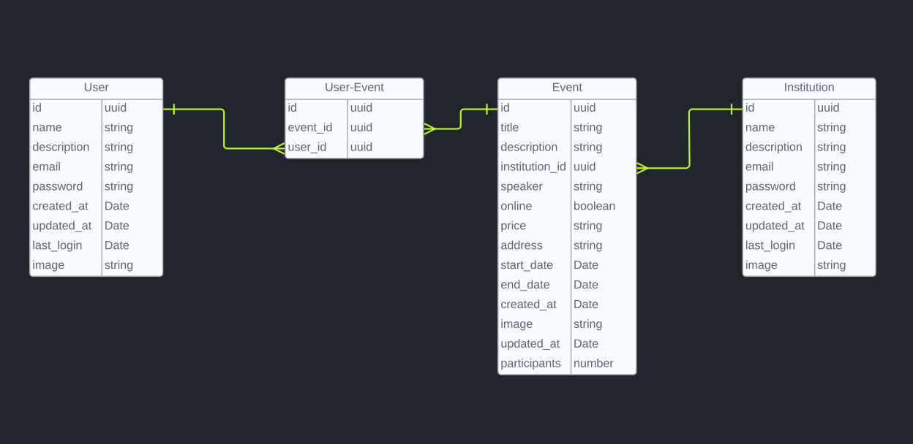

# Desafio MB-Labs
## Descrição
- Projeto back-end para um App de gestão de eventos.

## Tecnologias
- Typescript
- Node
- Express
- Jest
- Prisma 
- Postgresql
- Docker
- Docker-Compose
- Json Web Token
- Bcrypt

## Diagrama de Entidade e Relacionamento


## Executar Aplicação
```
npm i

npm run dev

npm run migrate
```

## Executar Teste
```
npm i

npm test
```


